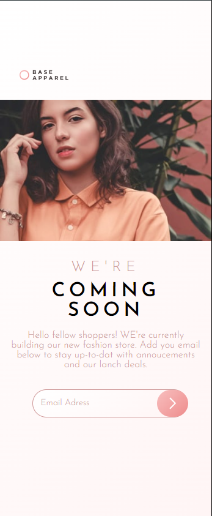

# Base Apparel coming soon page solution

## Table of contents

- [Overview](#overview)
- [The challenge](#the-challenge)
- [Screenshot](#screenshot)
- [Links](#links)
- [My process](#my-process)
- [Built with](#built-with)
- [What I learned](#what-i-learned)
- [Author](#author)

## Overview

### The challenge

Users should be able to:

- View the optimal layout for the site depending on their device's screen size
- See hover states for all interactive elements on the page
- Receive an error message when the `form` is submitted if:
- The `input` field is empty
- The email address is not formatted correctly

### Links

[VIEW DEMO](https://miron-silviu.github.io/base-appeal/)

### Screenshot



## My process

Starting the project by create index.html, styl.css and add normalizie.css files.
Inside index.html added html elements . Crate links for style and normalize.css.
Using mobile first approach.

### Built with

- Semantic HTML5 markup
- CSS custom properties
- Flexbox
- CSS Grid
- Mobile-first workflow
- [Styled Components](https://styled-components.com/) - For styles

### What I learned

Use this section to recap over some of your major learnings while working through this project. Writing these out and providing code samples of areas you want to highlight is a great way to reinforce your own knowledge.

To see how you can add code snippets, see below:

```html
<h1>Some HTML code I'm proud of</h1>
```

```css
.proud-of-this-css {
  color: papayawhip;
}
```

```js
const proudOfThisFunc = () => {
  console.log('🎉');
};
```

If you want more help with writing markdown, we'd recommend checking out [The Markdown Guide](https://www.markdownguide.org/) to learn more.

## Author

- Website - [Add your name here](https://www.your-site.com)
- Frontend Mentor - [Silviu Miron](https://www.frontendmentor.io/home)
- Twitter - [Silviu Miron](https://x.com/silviuumiron)
